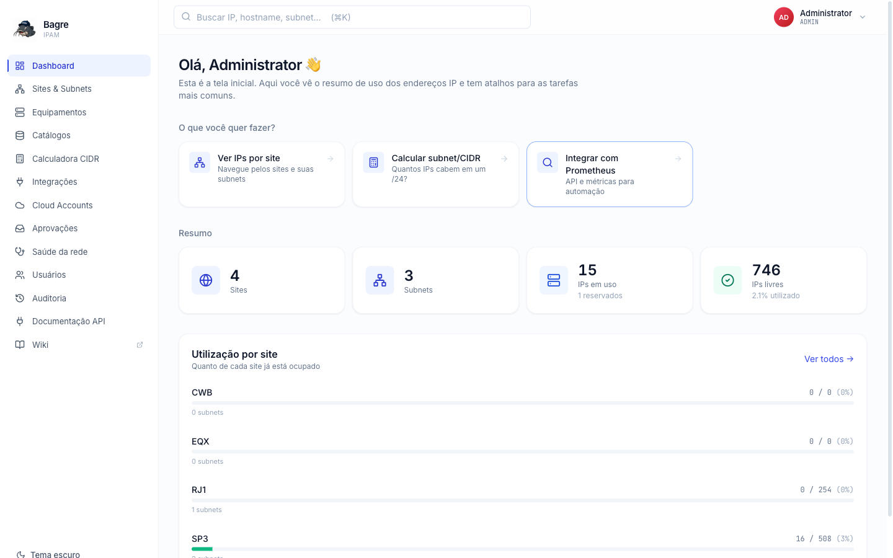
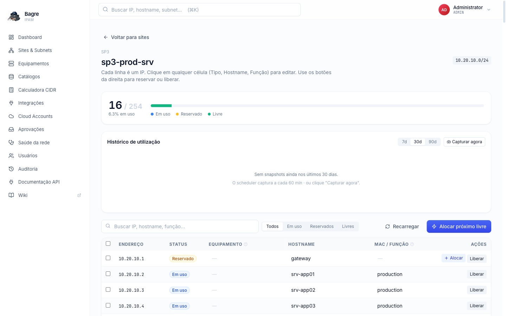
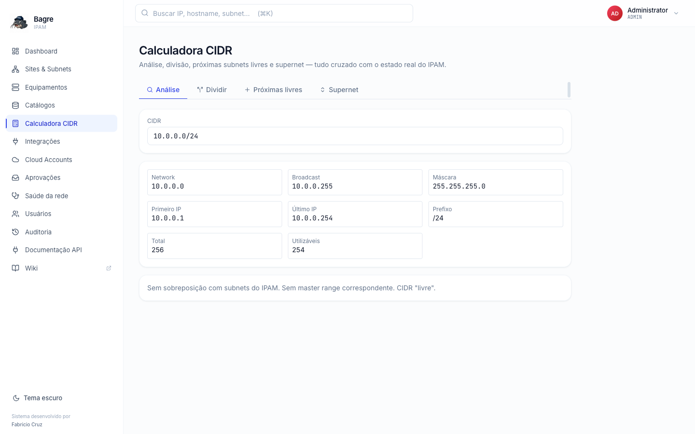
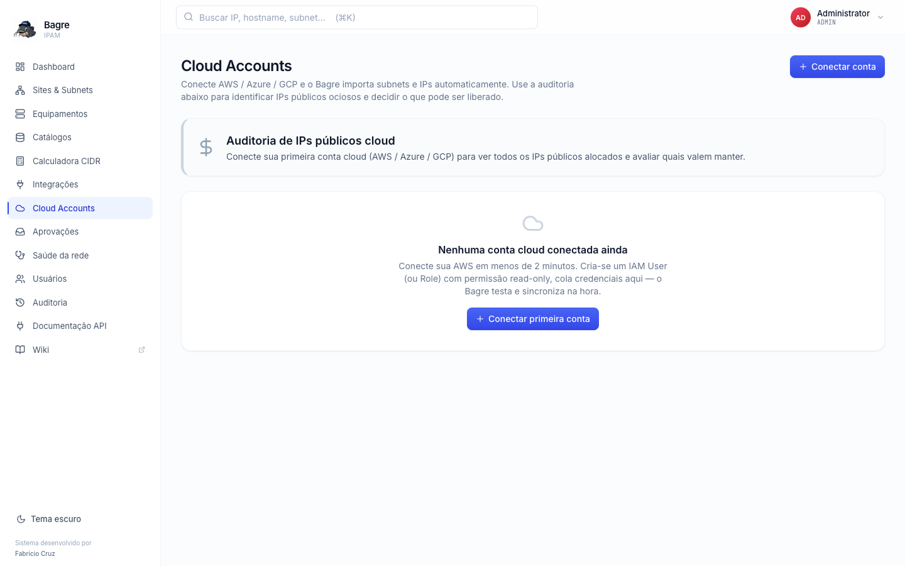

# Bagre

**Open Source IP Address Management**

Uma solução leve e poderosa para gerenciar, organizar e monitorar todos os
IPs da sua rede — de ambientes simples até infraestruturas híbridas complexas.

[](https://github.com/fabgcruz/bagre/releases/latest)
[](https://github.com/fabgcruz/bagre/actions/workflows/ci.yml)
[](LICENSE)
[](https://github.com/fabgcruz/bagre/stargazers)
[](https://github.com/fabgcruz/bagre/issues)
[](https://github.com/fabgcruz/bagre/graphs/contributors)
[](https://github.com/fabgcruz/bagre/commits/main)
[](https://github.com/fabgcruz/bagre/pulls)

---

## Por que Bagre?

O bagre é um peixe que vive nas águas turvas e se orienta pelos bigodes
sensíveis, detectando tudo ao seu redor. O Bagre IPAM segue a mesma lógica:

- **Enxerga** o que está oculto na rede
- **Detecta** mudanças e oportunidades (IPs disponíveis, hosts fantasmas, ranges fragmentados)
- **Funciona** em diferentes ambientes e infraestruturas
- **Silencioso, resistente e eficiente**
- **Mantém tudo organizado e sob controle**

## Screenshots

| | |
|---|---|
|  |  |
| **Dashboard** — resumo de uso + atalhos | **Subnet detail** — histórico de utilização + lista de IPs editáveis |
|  |  |
| **Calculadora CIDR avançada** — split, merge, next-free com detecção de overlap | **Cloud Accounts** — sync AWS/Azure/GCP + FinOps idle public IPs |

Mais prints em [`docs/screenshots/`](docs/screenshots/).

## O que o Bagre faz

- Catálogo central de sites, sub-redes (CIDR) e endereços IP com auditoria completa
- Alocação manual ou automática de IPs respeitando o range da sub-rede
- Importação de inventários existentes (XLSX/CSV)
- **Cloud sync multi-provider** — conecta AWS / Azure / GCP simultaneamente, sincroniza VPCs/VNets/subnetworks, NICs e IPs públicos. Mostra IPs ociosos sangrando custo (relatório FinOps unificado).
- **Descoberta automática via Zabbix e Prometheus** — hosts viram pending discoveries; aprovação em 1 clique
- API REST para integração com Terraform, scripts próprios, OTEL
- Login local + SSO via OIDC (Microsoft Entra ID, Keycloak, qualquer provider compatível)
- RBAC com perfis ADMIN/READER e wiki integrada via DokuWiki
- Métricas Prometheus em `/metrics`
- Trilha de auditoria com diff antes/depois de toda alteração

## Stack

- **Backend**: Node.js 20 + Fastify + Prisma + PostgreSQL 15
- **Frontend**: React + Vite + Tailwind CSS
- **Orquestração**: Docker Compose
- **Opcional**: DokuWiki para documentação operacional, Zabbix para descoberta automática

## Quickstart

Requisitos: Docker + Docker Compose plugin.

```bash
git clone https://github.com/fabgcruz/bagre.git
cd bagre

cp .env.example .env
# editar .env e definir ADMIN_TOKEN, JWT_SECRET, BOOTSTRAP_ADMIN_EMAIL/PASSWORD

docker compose up -d
```

Abra http://localhost:3000 e faça login com o e-mail/senha definidos no `.env`.

| Componente | URL |
|---|---|
| Web UI | http://localhost:3000 |
| API REST | http://localhost:3001 |
| Métricas Prometheus | http://localhost:3001/metrics |
| Health check | http://localhost:3001/api/health |

## Linha do tempo e evolução

| Versão | Data | Highlights |
|---|---|---|
| **[v1.0.0](https://github.com/fabgcruz/bagre/releases/tag/v1.0.0)** | 2026-06-17 | **Marco 1.0 — produção.** Site oficial em [bagre.dev](https://bagre.dev) e **demo público ao vivo** em [demo.bagre.dev](https://demo.bagre.dev) com descoberta de hosts via **Zabbix + Prometheus** e **PowerDNS** (pending → aprovação em 1 clique, com badge de origem). Ambiente de demonstração (`DEMO_MODE`) com login em 1 clique e reset diário. Estabilidade + hardening; sem novas features de IPAM. |
| **[v0.5.0](https://github.com/fabgcruz/bagre/releases/tag/v0.5.0)** | 2026-05-28 | **Cleanup do backlog (8 issues fechadas)** — DNS sync ([#17](https://github.com/fabgcruz/bagre/issues/17)) e validation engine ([#27](https://github.com/fabgcruz/bagre/issues/27)) end-to-end com UI. IPv6 first-class ([#10](https://github.com/fabgcruz/bagre/issues/10)), importação universal CSV/XLSX/JSON ([#13](https://github.com/fabgcruz/bagre/issues/13)), gerador de tutoriais Playwright ([#24](https://github.com/fabgcruz/bagre/issues/24)). **Primeiro bug fix da comunidade** ([#29](https://github.com/fabgcruz/bagre/issues/29)) — long-standing bug em CIDRs ≥128.0.0.0. Design specs pra Terraform Provider, K8s Operator, SNMP+topology e gRPC. |
| **[v0.4.0](https://github.com/fabgcruz/bagre/releases/tag/v0.4.0)** | 2026-05-28 | **Multi-cloud completo** — Azure ([#20](https://github.com/fabgcruz/bagre/issues/20)) e GCP ([#21](https://github.com/fabgcruz/bagre/issues/21)) implementados. FinOps idle-public-IPs report unificado entre AWS + Azure + GCP. Service Principal (Azure) e Service Account JSON (GCP) via REST puro, sem SDKs pesados. |
| **[v0.3.2](https://github.com/fabgcruz/bagre/releases/tag/v0.3.2)** | 2026-05-27 | **Histórico de capacidade** ([#11](https://github.com/fabgcruz/bagre/issues/11)) — gráfico SVG inline com IPs em uso ao longo do tempo (7d/30d/90d), indicador de tendência, linha de capacidade total. Scheduler de snapshot a cada 60min. |
| **[v0.3.1](https://github.com/fabgcruz/bagre/releases/tag/v0.3.1)** | 2026-05-27 | **Calculadora CIDR avançada** ([#12](https://github.com/fabgcruz/bagre/issues/12)) com 4 tabs (Análise / Dividir / Próximas livres / Supernet) cruzando com IPAM em tempo real. **Bulk ops nos IPs** ([#14](https://github.com/fabgcruz/bagre/issues/14)) — checkboxes + barra de ação flutuante (Reservar / Liberar / Editar campos em massa). |
| **[v0.3.0](https://github.com/fabgcruz/bagre/releases/tag/v0.3.0)** | 2026-05-27 | **Prometheus discovery** ([#25](https://github.com/fabgcruz/bagre/issues/25)) — sugestão da comunidade implementada em <24h. **Hardening de segurança** — JWT_SECRET fail-closed, sem mais `admin123` hardcoded, defaults inseguros do compose removidos. Sidebar reorganizada. Catálogos com abas dinâmicas por cloud account. CONTRIBUTING.md, SECURITY.md, issue templates. |
| **[v0.2.0](https://github.com/fabgcruz/bagre/releases/tag/v0.2.0)** | 2026-05-27 | **Cloud sync AWS** ([#19](https://github.com/fabgcruz/bagre/issues/19)) — VPCs, ENIs, Elastic IPs via Access Key OR Assume Role. **FinOps idle public IPs** ([#22](https://github.com/fabgcruz/bagre/issues/22)). Refocus do escopo — feature Firewall Rules removida (fora de IPAM). Mascote do Bagre + branding limpo. Quickstart fixado (HTTP em :3000, seed.json opcional). |
| **v0.1.0** | 2026-05-16 | **Initial release** — stack Docker Compose (Fastify + Prisma + PostgreSQL + React/Vite), catálogo de sites/subnets/IPs, alocação manual ou automática, importação XLSX/CSV, audit trail com diff antes/depois, SSO OIDC + RBAC, integração Zabbix nativa, endpoint /metrics Prometheus, wiki opcional via DokuWiki. |

- **[CHANGELOG.md](CHANGELOG.md)** — detalhe completo de cada release (features, breaking changes, bugs, infra)
- **[Releases](https://github.com/fabgcruz/bagre/releases)** — release notes formatadas no GitHub
- **[ROADMAP.md](ROADMAP.md)** — visão, princípios, fases planejadas até a 1.0.0
- **[Issues](https://github.com/fabgcruz/bagre/issues)** — backlog público, incluindo sugestões da comunidade

## Documentação

A pasta [`docs/`](docs/) contém guias detalhados:

- [`01-arquitetura.md`](docs/01-arquitetura.md) — Stack, modelo de dados, decisões
- [`02-instalacao.md`](docs/02-instalacao.md) — Subir do zero, requisitos
- [`03-uso-diario.md`](docs/03-uso-diario.md) — Operação pelo usuário final
- [`04-administracao.md`](docs/04-administracao.md) — Usuários, perfis, RBAC
- [`05-integracoes.md`](docs/05-integracoes.md) — Zabbix, OIDC, Prometheus
- [`06-api-rest.md`](docs/06-api-rest.md) — Endpoints com exemplos `curl`
- [`07-operacao.md`](docs/07-operacao.md) — Backup, restore, troubleshooting
- [`08-desenvolvimento.md`](docs/08-desenvolvimento.md) — Dev local, contribuir

Versão renderizada em HTML único navegável: [`docs.html`](docs.html) (gerada por `node scripts/build-docs-html.mjs`).

## Contribuindo

Pull requests e issues são bem-vindos. Veja **[CONTRIBUTING.md](CONTRIBUTING.md)** para fluxo, convenções e onde achar coisas.

## Segurança

Para reportar vulnerabilidade, **NÃO abra issue pública** — use o canal privado descrito em **[SECURITY.md](SECURITY.md)**.

## Licença

[MIT](LICENSE) — use, modifique, redistribua. Atribuição é apreciada mas não exigida.

## Status do projeto

Bagre é jovem e evoluindo. Considere produção a partir da versão `1.0.0` (ainda não lançada).
Hoje serve bem para laboratórios, ambientes internos e times pequenos.

---

> Bagre — IPAM que enxerga nas águas turvas da sua rede.
