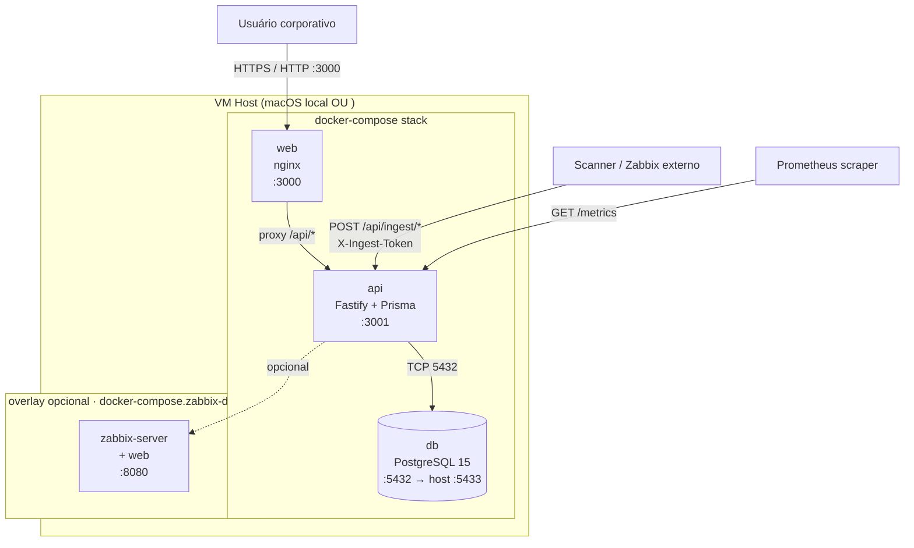
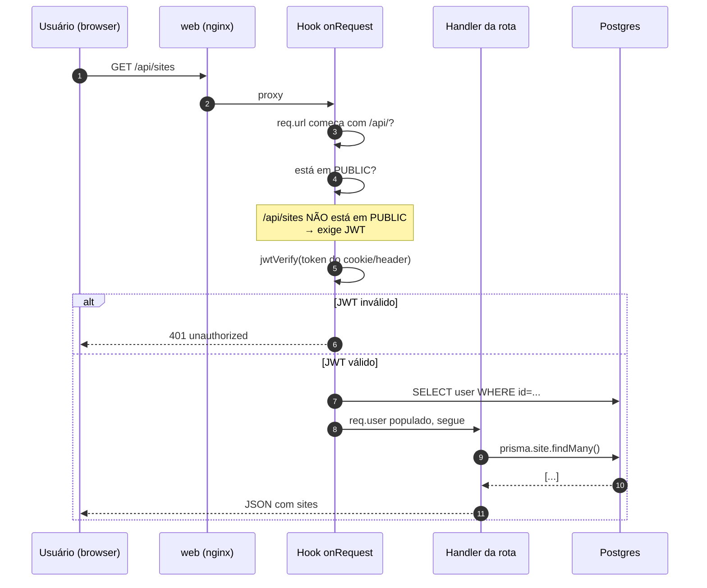

# Arquitetura — Bagre

> Documento "vivo" da arquitetura. Atualiza quando algo da topologia muda.
>
> **Renderização:** os diagramas Mermaid abaixo renderizam automaticamente no GitHub, GitLab, VSCode preview, Notion, Obsidian. Não precisa de ferramenta extra.

---

## 1. Visão geral — containers e portas

Stack composta por **3 containers principais** (+ 1 overlay opcional), orquestrados por `docker-compose.yml`:



**Portas expostas no host:**

| Porta | Serviço | Propósito |
|---|---|---|
| `3000` | web (nginx) | UI principal — usuários acessam aqui |
| `3001` | api (Fastify) | API REST direta (curl, scanners, Prometheus) |
| `5433` | db (Postgres) | Acesso de DBA / debug (mapeado de :5432 do container) |
| `8080` | zabbix (overlay) | Apenas se `docker-compose.zabbix-dev.yml` ativo |

---

## 2. Fluxo de autenticação (request normal)

Toda rota `/api/*` passa por um **hook global `onRequest`** em `apps/api/src/index.js` que valida JWT, **exceto** as rotas listadas no Set `PUBLIC`.



---

## 3. Endpoints públicos vs protegidos

```mermaid
graph LR
    subgraph Public["PUBLIC (sem auth) · whitelist no index.js"]
        H1[/api/health]
        H2[/api/config]
        L1[/api/auth/login]
        L2[/api/auth/reset-*]
        L3[/api/auth/sso/*]
        I1[/api/import/seed<br/>X-Admin-Token]
        I2[/api/ingest/*<br/>X-Ingest-Token]
        M1[/metrics]
        S1["/api/stats<br/>(condicional STATS_PUBLIC=true)"]
    end

    subgraph Protected["PROTEGIDOS (JWT obrigatório)"]
        P1[/api/sites]
        P2[/api/subnets]
        P3[/api/ips]
        P4[/api/users]
        P5["/api/audit/*"]
        P6["...todo resto"]
    end
```

> **Onde isso é declarado:** `apps/api/src/index.js`, linhas 48-62 (`PUBLIC` Set) + linhas 63-74 (hook `onRequest`).

---

## 4. Como atualizar este documento

### Quando algo da arquitetura muda

1. Você (ou Claude) altera o código da arquitetura (novo container, nova rota pública, nova integração).
2. Atualiza o diagrama Mermaid correspondente neste arquivo.
3. PR inclui o diff do diagrama na descrição.

### Quando a infra como código (Terraform) entrar

Quando o IPAM (ou outras frentes — Tele\*, Hub-Spoke) tiver Terraform versionado:

```bash
# Gera PNG bonito com ícones Azure
pip install terravision
terravision draw -s infra/terraform/

# OU Mermaid simplificado via Claude
# (Claude lê os .tf e atualiza este architecture.md)
```

### Convenção de tipos de diagrama

| Tipo | Quando usar | Sintaxe Mermaid |
|---|---|---|
| **Container/topology** | Mostrar serviços e como se conectam | `graph TB` ou `graph LR` |
| **Sequence** | Fluxo de uma request específica (login, deploy, etc) | `sequenceDiagram` |
| **State/lifecycle** | Estados de um IP (FREE → USED → RESERVED) | `stateDiagram-v2` |
| **ER** | Modelo de dados (Site → Subnet → IpAddress) | `erDiagram` |
| **Class** | Modelagem orientada a objeto | `classDiagram` |

---

## 5. Próximos diagramas a adicionar (TODO)

- [ ] Modelo de dados Prisma (ER diagram)
- [ ] State machine do IpAddress (FREE / USED / RESERVED / CONFLICT)
- [ ] Fluxo do `deploy.sh` (sequence: clone → build → up → healthcheck)
- [ ] Topologia  (quando virmos a infra)
- [ ] Fluxo do CI/CD pipeline (quando o pipeline existir)
